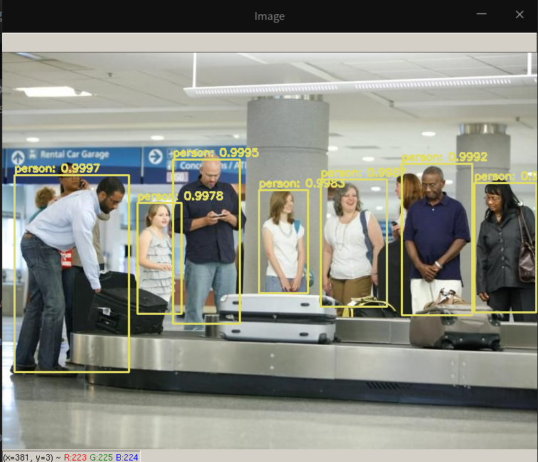
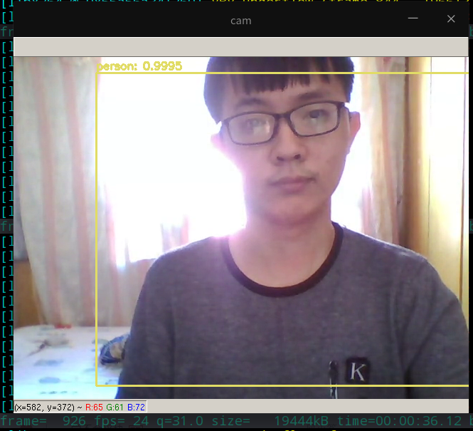

## 主要功能介绍

本项目设计并实现了基于 yolov3 的行人目标检测算法，并将该目标检测算法应用在图像和视频的识别检测之中。

实现的主要功能有：

- 对静态图像 (jpg、png) 中的行人进行识别，并框选出行人目标所在位置
- 对视频文件中的行人进行逐帧检测，并生成标记出行人位置的视频文件
- 对流媒体（rtsp、rtmp 协议）进行处理和分析，实时标记行人位置，可用于对监控视频流的处理


## 设计思路和实现方法

- yolov3 目标检测算法的改进

- 对静态图像中的行人进行识别

  - 项目封装了 python 函数 `detection_person` 用于处理静态图像，函数接口传入参数 `image_path` 指向待处理图像路径

  - 图像的读入和处理，使用 openCV 框架进行处理，使用 `cv2.imread` 函数将图像从硬盘读入内存，并使用 `cv2.dnn.readNet` 读入之前预训练的模型

  - 之后，将将输入的检测特征图转换成二维张量，并将网络前向传播

    ```python
    blob = cv2.dnn.blobFromImage(image, 1 / 255.0, (416, 416),
    swapRB=True, crop=False)
    net.setInput(blob)
    start = time.time()
    layerOutputs = net.forward(ln)
    end = time.time()
    ```

    使用目标分数阈值，对输出结果进行处理，保证检测进度，提高准确性

    ```python
            for detection in output:
                scores = detection[5:]
                classID = np.argmax(scores)
    
                if confidence > 0.7:  # 目标分数阈值
                    # scale the bounding box coordinates back relative to the
                    # size of the image, keeping in mind that YOLO actually
                    # returns the center (x, y)-coordinates of the bounding
                    # box followed by the boxes' width and height
                    box = detection[0:4] * np.array([W, H, W, H])
                    (centerX, centerY, width, height) = box.astype("int")
    
                    # use the center (x, y)-coordinates to derive the top and
                    # and left corner of the bounding box
                    x = int(centerX - (width / 2))
                    y = int(centerY - (height / 2))
    
                    # update our list of bounding box coordinates, confidences,
                    # and class IDs
                    boxes.append([x, y, int(width), int(height)])
                    confidences.append(float(confidence))
                    classIDs.append(classID)
    ```

    使用非最大抑制，防止为同一个行人目标对象标记多个邻近的位置

    ```python
    idxs = cv2.dnn.NMSBoxes(boxes, confidences, 0.5, 0.3)
    ```

    并将目标对象的范围为绘制在图像上：

    ```python
    (x, y) = (boxes[i][0], boxes[i][1])
    (w, h) = (boxes[i][2], boxes[i][3])
    
    # draw a bounding box rectangle and label on the image
    color = [int(c) for c in COLORS[classIDs[i]]]
    cv2.rectangle(image, (x, y), (x + w, y + h), color, 2)
    text = "{}: {:.4f}".format(LABELS[classIDs[i]], confidences[i])
    cv2.putText(image, text, (x, y - 5), cv2.FONT_HERSHEY_SIMPLEX,
    0.5, color, 2)
    ```

  - 最后将生成的检测结果保存到返回，或输出到硬盘中

    ```python
    #cv2.imshow("Image", image)
    if return_type == "path":
        outpath = image_path[0:image_path.rfind('.')] + "_out" + image_path[image_path.rfind('.'):]
        #print(outpath)
        cv2.imwrite(outpath, image)
        return outpath
    elif return_type == "img":
        return image
    ```

- 对视频文件中的行人目标进行识别

  - 使用 `cv2.VideoCapture` 方法，加载待处理的视频对象，并使用 `vs.read()` 方法，逐帧获取图像内容

  - 初始化视频写入对象

    ```python
    fourcc = cv2.VideoWriter_fourcc(*"mp4v")
    writer = cv2.VideoWriter(args["output"], fourcc, 30,(frame.shape[1],frame.shape[0]), True)
    ```

  - 处理完成一帧之后，将帧内容写入视频文件当中

    ```python
    writer.write(frame)
    print(f"[Process] frame id: {frameid}")
    elap = (end - start)
    print("[INFO] single frame took {:.4f} seconds".format(elap))
    frameid += 1
    ```

- 对流媒体内容进行处理和分析

  - 使用 `cv2.VideoCapture` 进行流媒体输入的读取

    ```python
    rtscap = RTSCapture.create("rtsp://127.0.0.1:8554/live1.h264")
        rtscap.start_read()  # 启动子线程并改变 read_latest_frame 的指向
    
        while rtscap.isStarted():
            ok, frame = rtscap.read_latest_frame()  # read_latest_frame() 替代 read()
            if not ok:
                if cv2.waitKey(100) & 0xFF == ord('q'): break
                continue
    
            # 帧处理代码
            yolo.detection_person_img(frame, tiny=True)
            cv2.imshow("cam", frame)
    
            if cv2.waitKey(100) & 0xFF == ord('q'):
                break
    ```

    

  - 经过测试 `cv2.VideoCapture` 的 `read` 函数并不能获取实时流的最新帧，而是按照内部缓冲区中顺序逐帧的读取，opencv会每过一段时间清空一次缓冲区。但是清空的时机并不是我们能够控制的，因此如果对视频帧的处理速度如果跟不上接受速度那么每过一段时间，在播放时时会看到画面突然花屏，甚至程序直接崩溃

  - 因此，本项目使用一个临时变量作为缓存，然后开启一个线程读取最新帧保存到缓存里，读取的时候只返回最新的一帧。读取时自动丢弃一些视频帧，防止处理速度跟不上输入速度。而导致程序崩溃或者后续视频画面花屏。

    ```python
    rtscap = RTSCapture(url)
            rtscap.frame_receiver = threading.Thread(target=rtscap.recv_frame, daemon=True)
            rtscap.schemes.extend(schemes)
            if isinstance(url, str) and url.startswith(tuple(rtscap.schemes)):
                rtscap._reading = True
    ```

## 开发和运行环境

- 开发环境：PyCharm 2019.3.4 (Professional Edition)
- 操作系统：Linux  4.15.0-30deepin-generic #31 SMP Fri Nov 30 04:29:02 UTC 2018 x86_64 GNU/Linux
- python 版本：Python 3.7.7 (default, Mar 26 2020, 15:48:22)  [GCC 7.3.0] :: Anaconda, Inc. on linux


## 软件截图

- 对静态图像中的行人进行检测和标识



- 对摄像头捕获的视频流数据进行实时处理

  

## 总结与说明

本项目设计并实现了一个基于 YOLOv3 的行人检测算法，提升了行人识别的成功率，并将改行人检测算法运用到静态图像和视频流的检测和标注之中，并使用使用缓存线程，解决了处理速度跟不上输入速度。而导致程序崩溃或者后续视频画面花屏的问题，提升了稳定性。